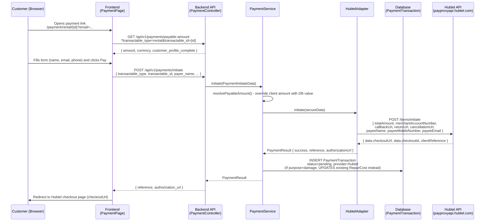
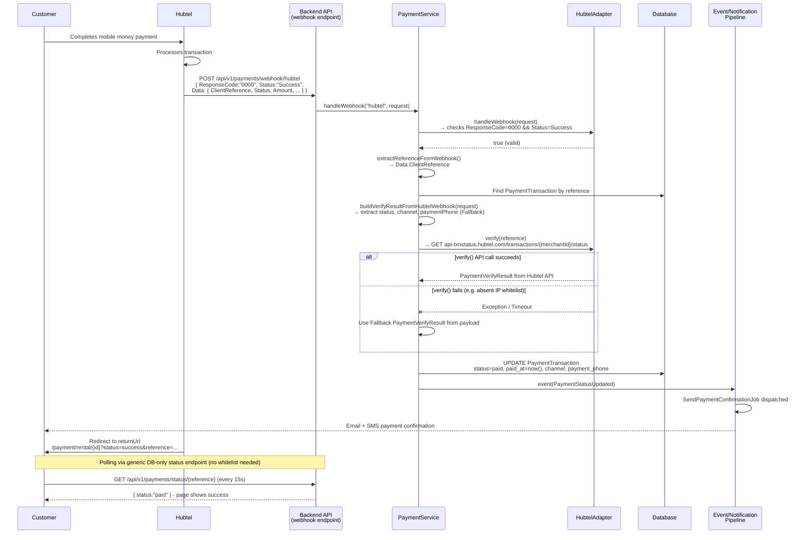
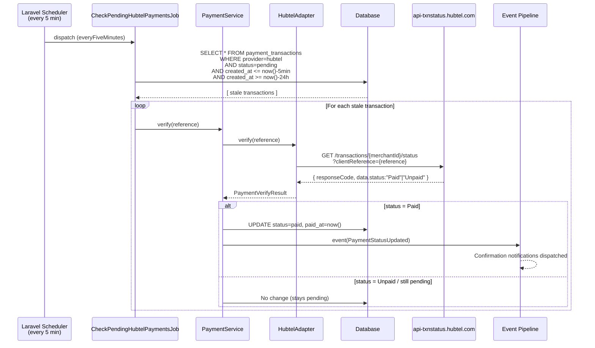
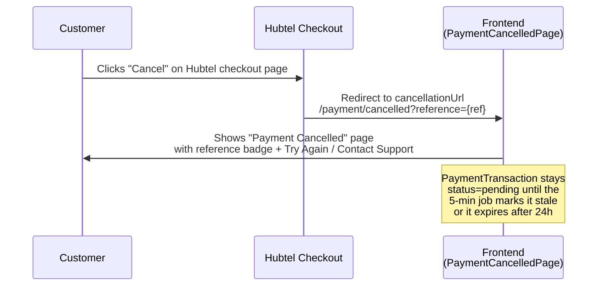
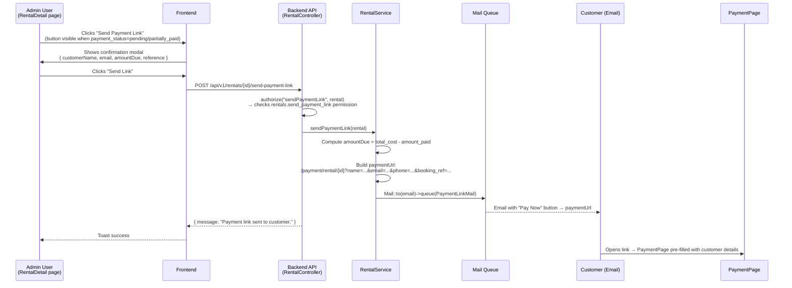
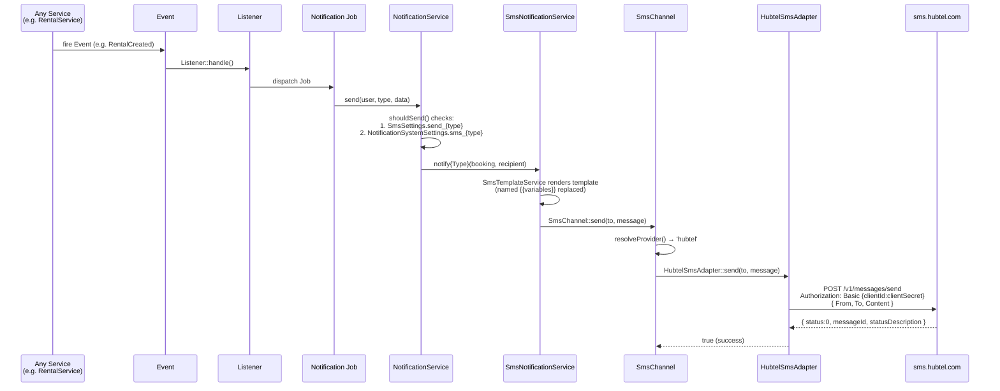
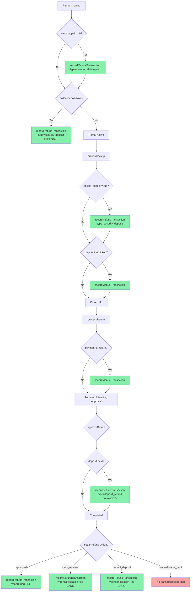
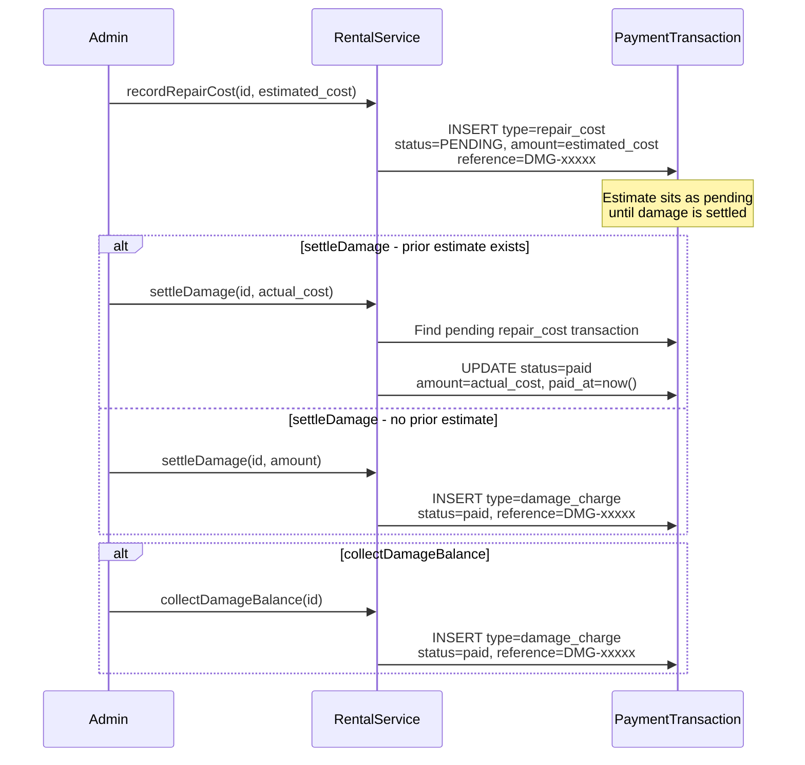
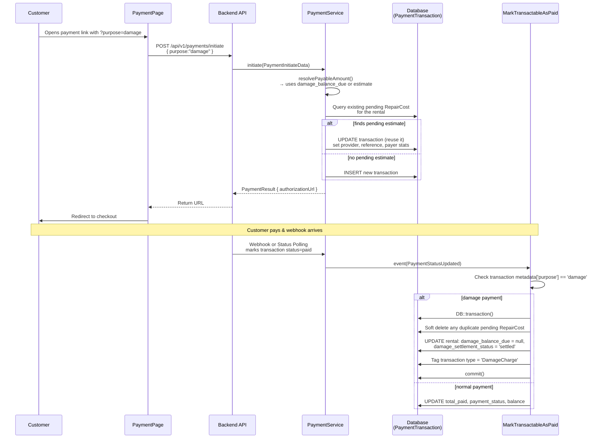

# Swiftflitz Payment & Notification Implementation Diagrams

---

## 1. Online Payment Initiation Flow (Hubtel)

---

## 2. Payment Completion - Webhook Path (Happy Path)

---

## 3. Mandatory 5-Minute Status Check (Hubtel Fallback)

> Required by Hubtel: if no webhook is received within 5 minutes, the merchant MUST call the status check API.

---

## 4. Payment Cancellation Flow

---

## 5. Admin "Send Payment Link" Flow

---

## 6. Hubtel SMS Notification Flow

---

## 7. Transaction Recording Lifecycle (RentalService)

---

## 8. Damage & Repair Transaction Lifecycle

---

## 9. Online Damage Payment Flow (`purpose=damage`)

