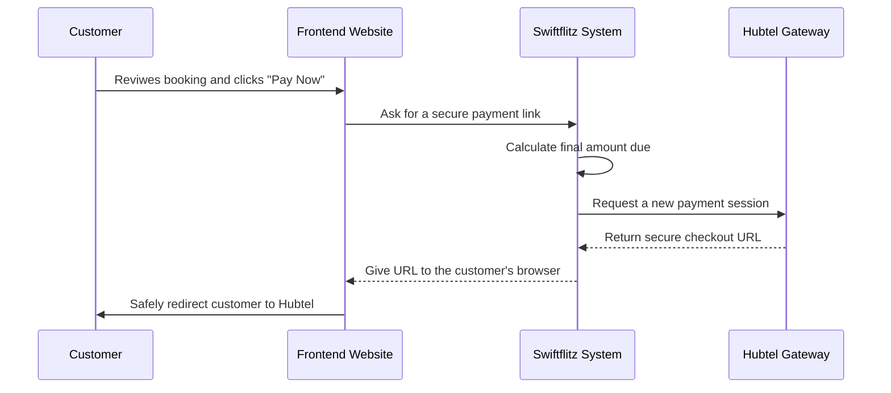
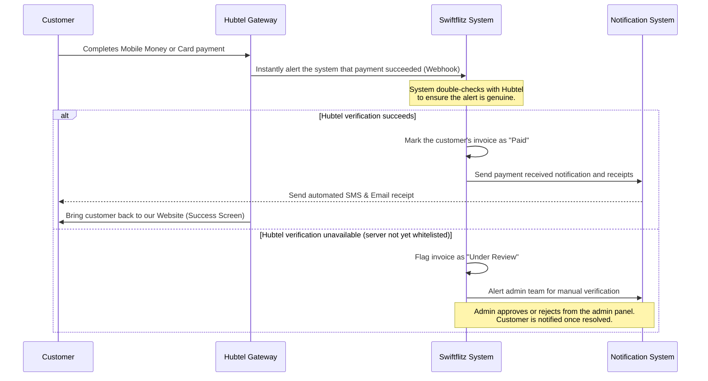
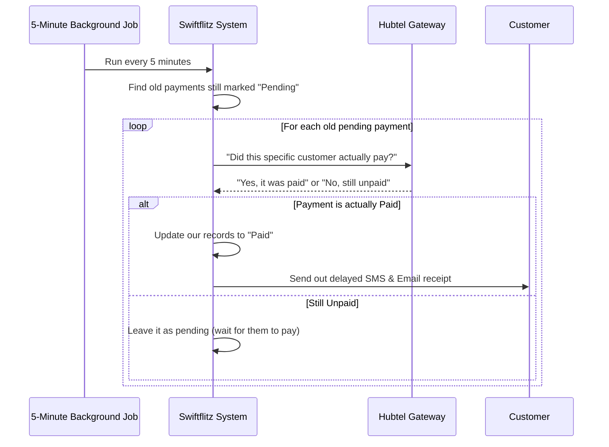
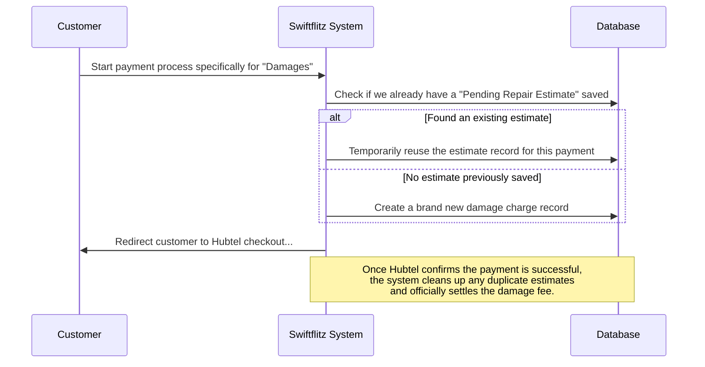

# Hubtel Payment Workflows (Simplified)

These diagrams represent the Hubtel payment integration using plain-English concepts to easily understand the logic flows, stripping away overly technical code references.

---

## 1. Initiating a Payment

When a customer decides to securely pay for their rental online.

---

## 2. Successful Payment (Automated Notification)

What happens immediately after the customer enters their PIN and the payment clears on Hubtel's side.

---

## 3. The 5-Minute Safety Net (Fallback Check)

Sometimes, network issues prevent Hubtel from instantly notifying our system. The system automatically double-checks missed notifications.

---

## 4. Paying for Damages (Special Case)

When a customer is paying specifically for vehicle damages rather than a normal rental fee. We must be careful not to double-charge them or duplicate records.

