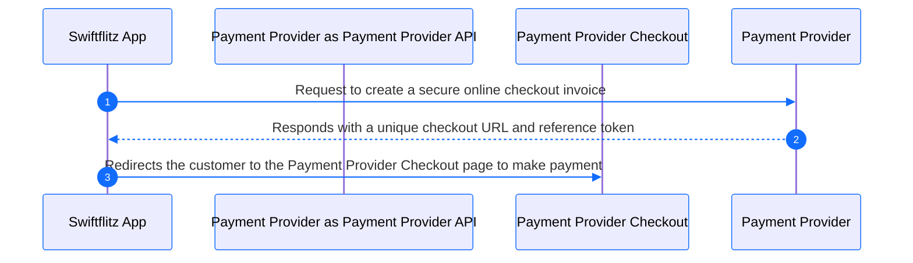
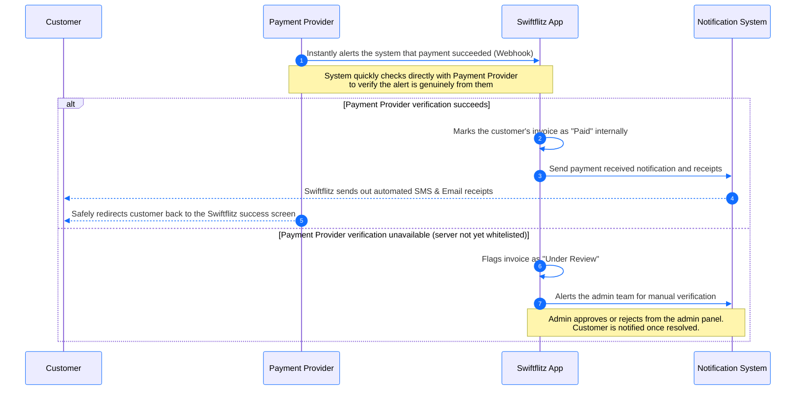
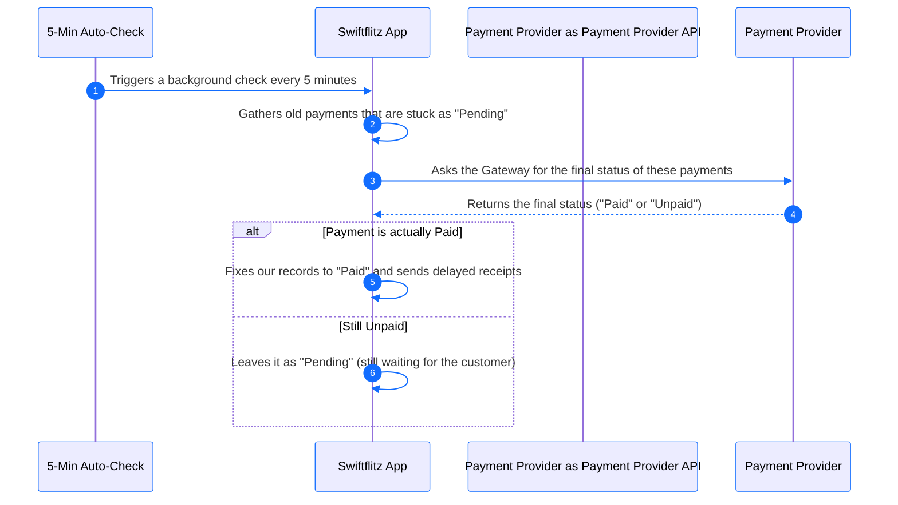
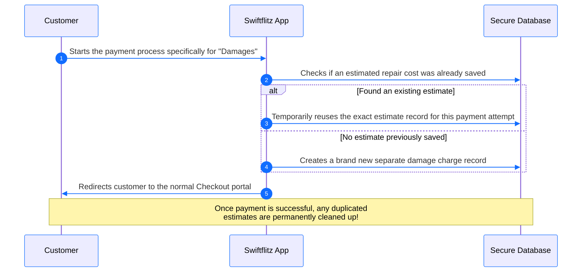

# Payment Provider Payment Workflows (Sleek)

These diagrams represent the Payment Provider payment integration using simple, non-technical language. The visual design is customized using the Swiftflitz system colors (Primary Blue: `#126dff`, Secondary Dark: `#00203f`).

---

## 1. Initiating a Payment

When a customer decides to securely pay for their rental online.

---

## 2. Successful Payment (Automated Notification)

What happens immediately after the customer enters their PIN and the payment clears on Payment Provider's side.

---

## 3. The 5-Minute Safety Net (Fallback Check)

Sometimes, network issues prevent Payment Provider from instantly notifying our system. The system automatically double-checks missed notifications.

---

## 4. Paying for Damages (Special Case)

When a customer is paying specifically for vehicle damages rather than a normal rental fee.

