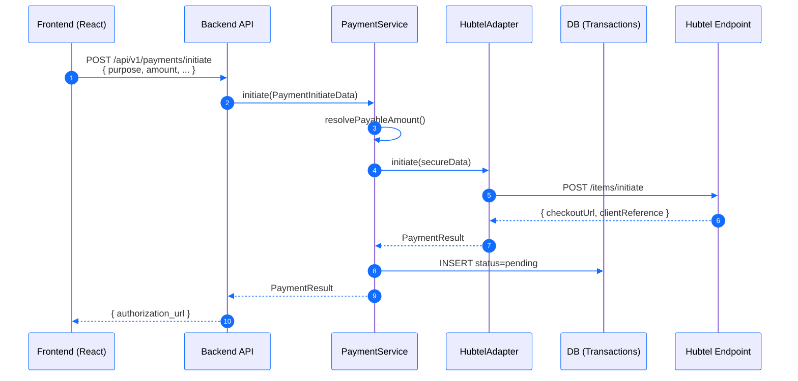
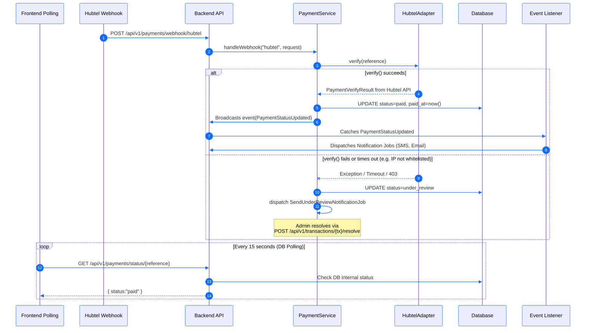
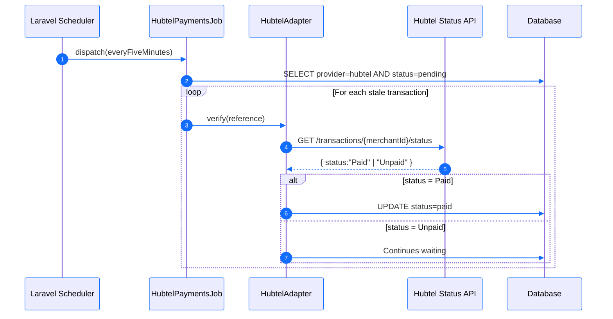
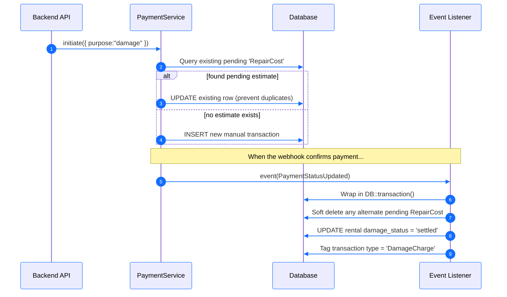

# Hubtel Payment Workflows (Sleek Technical)

These diagrams outline the technical flow of the Hubtel payment integration. The visual design is customized using the Swiftflitz system fonts and colors (Primary Blue: `#126dff`, Secondary Dark: `#00203f`).

---

## 1. Payment Initiation (Hubtel Checkout)

---

## 2. Successful Payment (Webhook Callback & Priority Polling)

---

## 3. Mandatory 5-Minute Setup (Fallback CRON)

---

## 4. Online Damage Payment Flow (`purpose=damage`)

