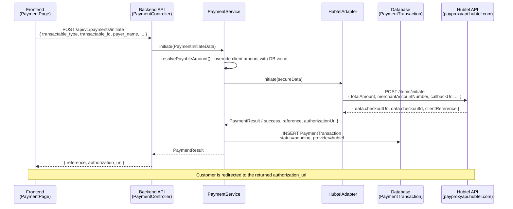
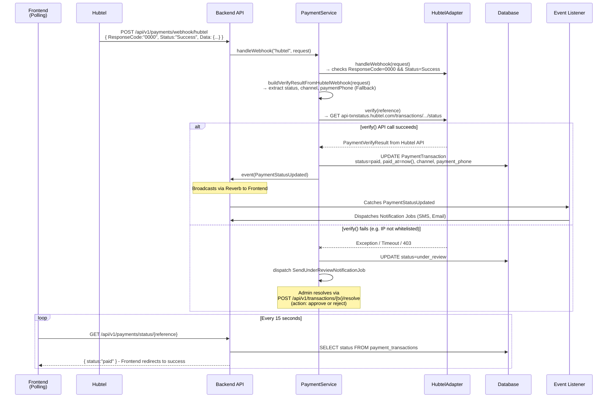
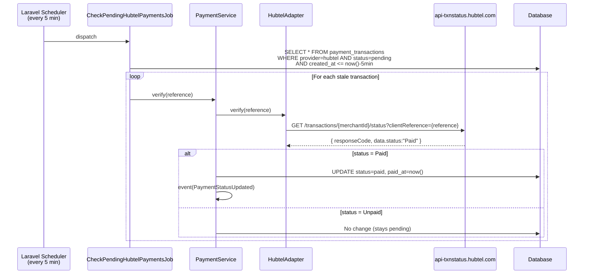
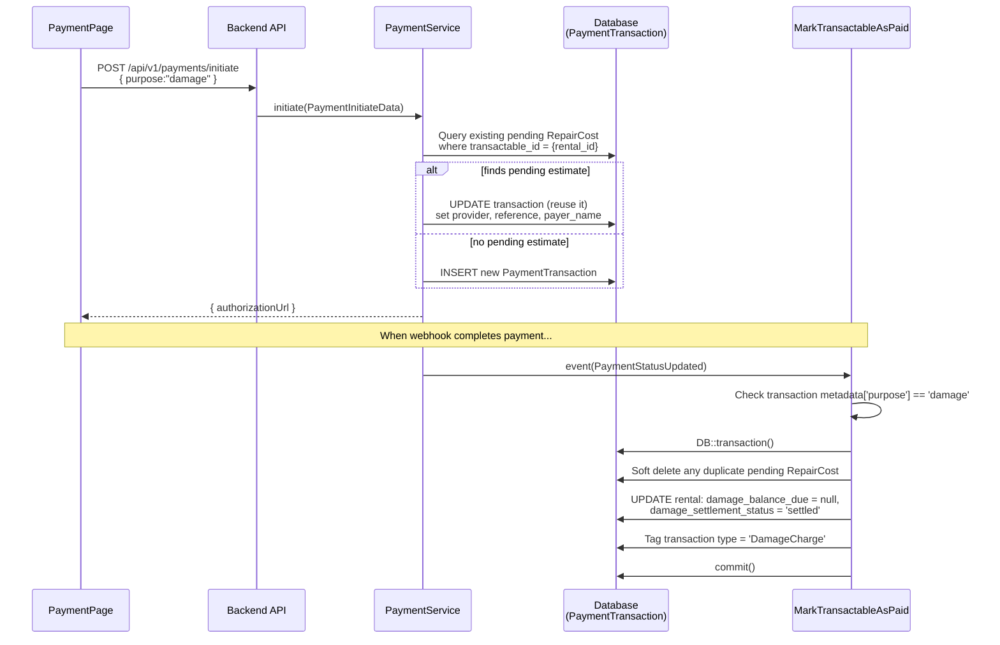

# Hubtel Payment Workflows (Technical)

These diagrams outline the technical flow of the Hubtel payment integration, highlighting classes, API endpoints, payload data, and database interactions.

---

## 1. Payment Initiation (Hubtel Checkout)

The technical process of generating a Hubtel checkout URL from the frontend request.

---

## 2. Successful Payment (Webhook Callback & DB-Only Polling)

How the system securely receives payment confirmation from Hubtel. If the Transaction Status Check API is unreachable (IP not whitelisted), the payment is flagged for admin review instead of auto-marking paid.

---

## 3. Mandatory 5-Minute Status Check (Job Fallback)

Hubtel's required polling fallback to catch missed webhooks.

---

## 4. Online Damage Payment Transaction Flow (`purpose=damage`)

How the system intercepts damage payments to prevent duplicate invoice records from being generated.

